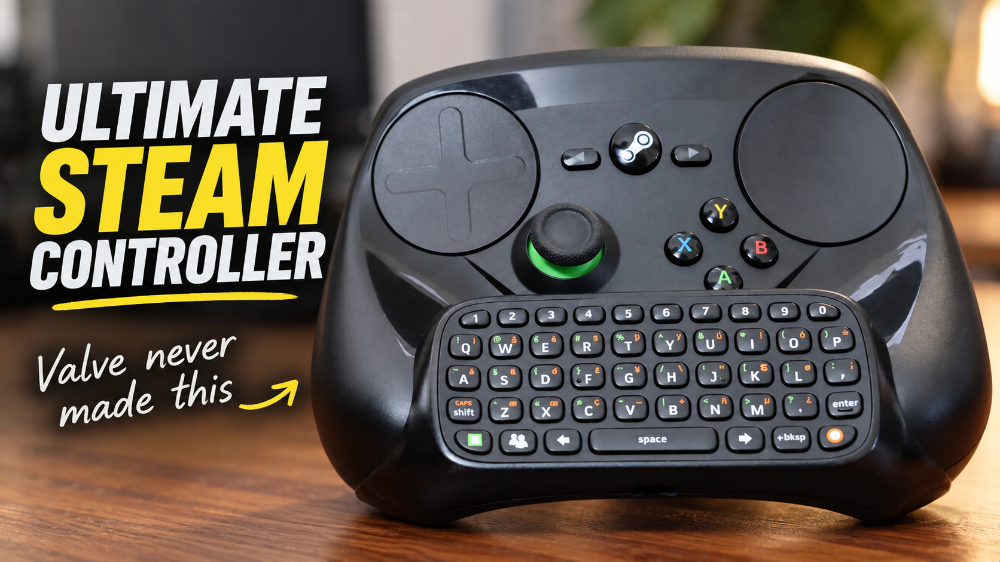

# Contributing

[← Project home](README.md) · [Documentation](docs/README.md) · [Issue tracker](https://github.com/ZRZStudio/Steam-Controller-Chatpad/issues)

This firmware powers the chatpad conversion featured in the [full OG Steam Controller (2015) upgrade and modification video](https://www.youtube.com/watch?v=59sTsHHFOmE) on the **ZRZ YouTube channel**.

  

Useful contributions include reproducible bug reports, clearer build instructions, compatibility results, and tested firmware changes.

## Report a problem

Check [troubleshooting](docs/TROUBLESHOOTING.md) and existing issues, then [open a bug report](https://github.com/ZRZStudio/Steam-Controller-Chatpad/issues/new?template=bug_report.md).

Include board model, host OS, keyboard layout, firmware commit, board-core version, and both BLE library versions. Describe the shortest steps that reproduce it. For compiler failures, include the first error rather than only the final failure summary.

## Suggest a feature

Use the [feature request template](https://github.com/ZRZStudio/Steam-Controller-Chatpad/issues/new?template=feature_request.md). Explain the use case and any wiring or compatibility implications. Discuss substantial changes before investing in a large implementation.

## Submit a pull request

1. Fork the repository and make a focused branch.
2. Keep the sketch in `SteamChatpad/SteamChatpad.ino`.
3. Preserve hardware defaults unless the proposed change explicitly requires otherwise.
4. Write comments that explain intent, protocol details, or hardware constraints.
5. Update relevant documentation and the **Unreleased** changelog section.
6. Describe what you tested, including software versions and hardware used.

For documentation changes, check links, tables, and menu sequences against the source. Compile firmware changes and, where hardware is available, check them on an Arduino Nano ESP32 with an original Xbox 360 Chatpad.

## Firmware verification

Choose checks relevant to your change and record the results:

| Area | Useful checks |
| :--- | :--- |
| Input | Letters, numbers, UK punctuation, and affected symbol layers. |
| Modifiers | Tap, hold, double-tap, and cancellation. |
| Bluetooth | Fresh pairing, reconnect, slot switching, and replacement. |
| Settings | Green confirm, Orange back, timeouts, and saved values after restart. |
| Power | Inactivity sleep, manual sleep, Green press/release wake, and reconnection. |
| Supply monitor | Disabled operation; measured mode only with a fitted, calibrated circuit. |

If hardware testing is unavailable, say so. Compilation alone is not a hardware test.

## Scope and attribution

Keep unrelated formatting changes separate from functional work. Respect dependency licences and credit adapted code or diagrams. Contributions are made under the project's [MIT licence](LICENSE).
