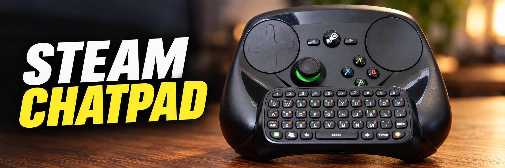
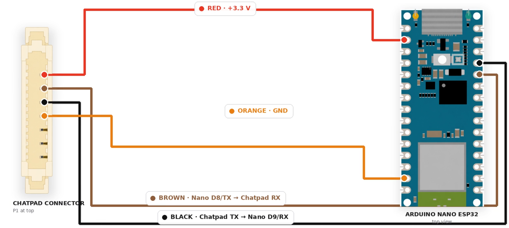

  

<h1 align="center">Steam Chatpad</h1>

  <strong>A chatpad for the OG Steam Controller</strong> 
  using an Xbox 360 chatpad and an Arduino Nano ESP32.

  
  
  
  

  <a href="https://www.youtube.com/watch?v=59sTsHHFOmE"><strong>Project video</strong></a>
  &nbsp;·&nbsp;
  <a href="https://github.com/ZRZStudio/Steam-Controller-Chatpad/archive/refs/heads/main.zip"><strong>Download source</strong></a>
  &nbsp;·&nbsp;
  <a href="docs/GETTING_STARTED.md"><strong>Build guide</strong></a>
  &nbsp;·&nbsp;
  <a href="docs/CONTROLS.md"><strong>Controls</strong></a>

---

## The project

Steam Chatpad turns an original **Xbox 360 Chatpad** into a **Bluetooth Low Energy HID keyboard**. An Arduino Nano ESP32 reads the Chatpad over UART and sends keyboard input to a paired host.

Full OG Steam Controller (2015) upgrade and modification video found on the ZRZ YouTube channel. This firmware is designed for Steam Controller chatpad conversions part of the video. It can also be adapted to other builds that need a small physical keyboard. The keyboard uses its own Bluetooth connection to the host.

  
   
  <a href="https://www.youtube.com/watch?v=59sTsHHFOmE"><strong>▶ Watch the project video on YouTube</strong></a>

This repository contains the firmware and electrical connection guide. For more details about the build, check out the build video.

## At a glance

| Feature | What it does |
| :--- | :--- |
| **UK keyboard mapping** | Letters, navigation keys, and Green / Orange symbol layers. |
| **Flexible modifiers** | Tap for one key, hold while typing, or double-tap to latch. |
| **Three saved hosts** | Pair into numbered slots and switch between remembered devices. |
| **Settings on the Chatpad** | Number-key navigation with Green / Orange LED feedback. |
| **Power profiles** | Backlight and sleep presets, with custom timeout overrides. |
| **Dedicated wake button** | Wake from light sleep using the isolated Green switch. |
| **Optional supply monitoring** | Estimate a BLE battery value from the regulated supply rail. |

> [!IMPORTANT]
> Use a **3.3 V supply**, an **Arduino Nano ESP32**, and the **isolated Green-button wiring** described in the build guide. Set the host keyboard layout to **English (United Kingdom)**. Some extended symbols use Windows Alt+numpad sequences and are host-dependent.

## Get started

1. **Check the hardware.** Read the [wiring guide](docs/WIRING.md), including the Green-button modification.
2. **Download the project.** [Download source](https://github.com/ZRZStudio/Steam-Controller-Chatpad/archive/refs/heads/main.zip) and extract the ZIP.
3. **Install the tools.** Set up Arduino IDE, a compatible ESP32 board core, `HijelHID_BLEKeyboard`, and `NimBLE-Arduino` using the [installation guide](docs/GETTING_STARTED.md#install-the-software).
4. **Upload the sketch.** Open [`SteamChatpad/SteamChatpad.ino`](SteamChatpad/SteamChatpad.ino), select **Arduino Nano ESP32**, then compile and upload.
5. **Pair and type.** On a fresh setup, look for **`steam chatpad`** in the host's Bluetooth settings. The first host is saved in slot 1.

**[Follow the complete setup guide →](docs/GETTING_STARTED.md)**

## Hardware connections

| Connection | Nano ESP32 pin | ESP32 GPIO |
| :--- | :--- | :--- |
| Chatpad TX → Nano RX | **D9** | GPIO18 |
| Chatpad RX ← Nano TX | **D8** | GPIO17 |
| Isolated Green switch → GND when pressed | **D2** | GPIO5 |
| Optional voltage-divider midpoint | **A0** | GPIO1 |
| Chatpad power / ground | **Regulated 3.3 V / common GND** | — |

The pin names refer to the Nano board labels. See [wiring and pin numbering](docs/WIRING.md) before connecting anything.

  

## Everyday controls

Hold **Green + Orange**, then release both buttons within the relevant time window:

| Hold duration | Action |
| :--- | :--- |
| **3 to under 5 seconds** | Select a saved host, then press **1**, **2**, or **3**. |
| **5 to under 7 seconds** | Open the settings menu. |
| **7 seconds or longer** | Request light sleep. |

Press and release **Green** to wake. In settings, use **number keys** to choose, **Green** to confirm, and **Orange** to go back.

| Shortcut | Result |
| :--- | :--- |
| Green / Orange + Left or Right | Up / Down |
| Green + Backspace / Space / Enter | Delete / Tab / Home |
| Orange + Backspace / Space / Enter | Escape / Shift+Tab / End |
| Shift + Orange | Toggle Caps Lock |

**[Full controls and settings reference →](docs/CONTROLS.md)**

## Power and backlight

| Profile | Backlight idle timeout | Sleep idle timeout |
| :--- | ---: | ---: |
| Super Power Saver | 3 seconds | 12 seconds |
| **Power Saver — default** | **6 seconds** | **25 seconds** |
| Normal | 10 seconds | 60 seconds |

Both inactivity and the manual shortcut use light sleep. Waking restarts the firmware and reconnects to the saved host. Host slots and settings are stored persistently.

The Chatpad hardware limits a continuous backlight period to roughly **six seconds**. A longer software timeout does not extend that continuous period; the firmware avoids periodically retriggering the lamp to prevent visible blinking.

Battery reporting defaults to a fixed **100%**. Optional measured mode reads the **regulated 3.3 V rail**, so its thresholds need calibration and should not be treated as a battery fuel gauge.

**[Power settings and supply monitoring →](docs/CONFIGURATION.md)**

## Documentation

| Guide | Start here if you want to… |
| :--- | :--- |
| [Getting started](docs/GETTING_STARTED.md) | Install dependencies, upload, and pair for the first time. |
| [Wiring](docs/WIRING.md) | Connect UART, isolate Green, and add the optional divider. |
| [Controls and settings](docs/CONTROLS.md) | Look up shortcuts, menu paths, and LED signals. |
| [Configuration](docs/CONFIGURATION.md) | Understand defaults, power profiles, and supply monitoring. |
| [Troubleshooting](docs/TROUBLESHOOTING.md) | Diagnose compilation, Bluetooth, keyboard, and wake problems. |
| [Changelog](CHANGELOG.md) | Read release history and documentation changes. |

## Downloads and compatibility

- **Current source:** [Download ZIP](https://github.com/ZRZStudio/Steam-Controller-Chatpad/archive/refs/heads/main.zip), or use **Code → Download ZIP**.
- **Original v1.0.0 source snapshot:** [Download the initial package](https://github.com/ZRZStudio/Steam-Controller-Chatpad/archive/8701ad8f0aba50c10a1aa0361a7fc05b8d8a0bed.zip).
- **Build target:** Arduino Nano ESP32 with an original Xbox 360 Chatpad. Other boards may require changes.
- **Host input:** BLE HID with UK mappings. Extended Alt-code symbols depend on the host OS and application; equivalent behaviour on SteamOS, Linux, macOS, or mobile hosts is not established here.
- **Build versions:** A pinned, project-tested dependency combination is not yet recorded. The [setup guide](docs/GETTING_STARTED.md#install-the-software) links the library requirements.

Downloads contain **source code**. Compile the sketch in Arduino IDE; a prebuilt firmware binary is not provided.

## Contributing

Reproducible bug reports, documentation fixes, and tested hardware improvements are welcome. Read [CONTRIBUTING.md](CONTRIBUTING.md) before opening a pull request, or use the [issue templates](https://github.com/ZRZStudio/Steam-Controller-Chatpad/issues/new/choose).

When reporting a working build, include board-core and library versions, host OS, and keyboard layout. This helps build a useful compatibility record.

## Credits and licence

A project from [ZRZStudio](https://github.com/ZRZStudio), built with [HijelHID_BLEKeyboard](https://github.com/HijelHub/HijelHID_BLEKeyboard), [NimBLE-Arduino](https://github.com/h2zero/NimBLE-Arduino), and the Arduino ESP32 ecosystem.

Project code and documentation are available under the [MIT licence](LICENSE). Dependencies retain their own licences.

This is an unofficial community project, unaffiliated with Valve, Microsoft, Xbox, or Arduino. Verify wiring and supply voltage before powering modified hardware.
