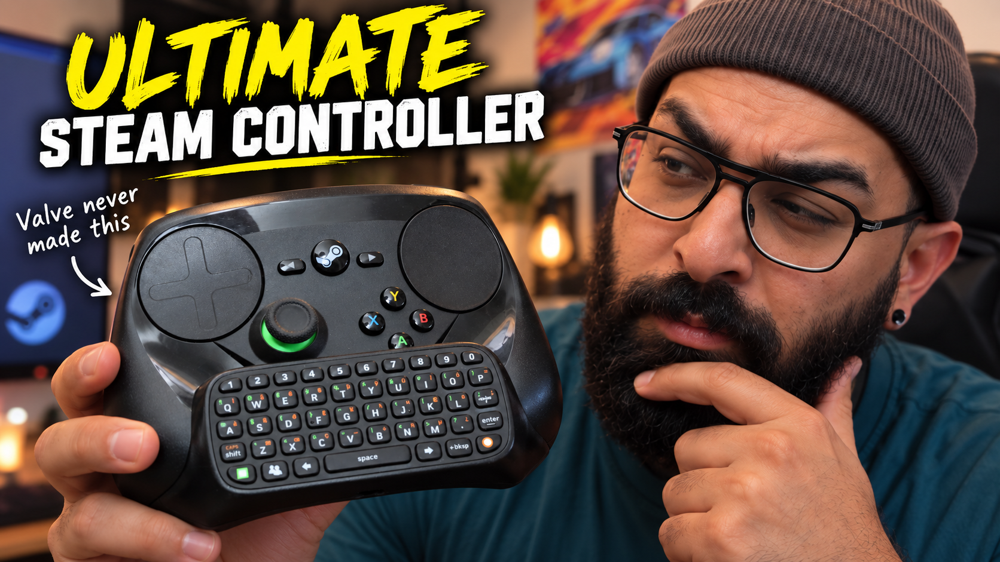

# Configuration and power

[← Project home](../README.md) · [Documentation](README.md) · [Controls](CONTROLS.md)

This firmware powers the chatpad conversion featured in the [full OG Steam Controller (2015) upgrade and modification video](https://www.youtube.com/watch?v=59sTsHHFOmE) on the **ZRZ YouTube channel**.

  

## Defaults
Everyday settings can be changed on the Chatpad and are saved across restarts. Hardware constants are grouped in `namespace Config` near the top of [`SteamChatpad.ino`](../SteamChatpad/SteamChatpad.ino).

These apply when no saved setting overrides them.

| Setting | Default |
| :--- | :--- |
| Bluetooth device name | `steam chatpad` |
| Host slots | 3; fresh pairing uses slot 1 |
| Power profile | Power Saver |
| Backlight idle timeout | 6 seconds |
| Sleep idle timeout | 25 seconds |
| Bluetooth transmit power | Low |
| Reconnect mode | Balanced |
| Battery reporting | Disabled; host receives a fixed 100% |
| Active CPU frequency | 80 MHz |
| Debug logging | Disabled |

The device name is set in the `HijelHID_BLEKeyboard` constructor, outside `namespace Config`.

## Power profiles

| Menu choice | Profile | Backlight timeout | Sleep timeout |
| :--- | :--- | ---: | ---: |
| 1 | Super Power Saver | 3 s | 12 s |
| 2 | Power Saver | 6 s | 25 s |
| 3 | Normal | 10 s | 60 s |

Choose a profile through **Settings → 2 → 1 → choice → Green**. A profile change clears timeout overrides.

Custom backlight timeouts accept **0–30 seconds**; zero turns the idle backlight off. Custom sleep timeouts accept **1–120 seconds**. Zero or values over 120 resolve to 120 seconds. Use **Settings → 2 → 4 → Green** to restore the selected profile's timeouts.

### Backlight limitation

The Chatpad controller limits a continuous lamp-on period to roughly six seconds. The firmware tracks that timeout and does not keep retriggering the lamp. A 10-second profile setting therefore does not guarantee 10 seconds of continuous illumination.

### Sleep and wake

Automatic inactivity sleep and the seven-second hold shortcut call the same light-sleep routine. It releases held keys, stops BLE advertising, turns off indicators, stops UART keep-alives, and prepares unused pins for low-power operation.

**Green on D2 is the wake input.** After light sleep ends, the firmware restarts. Release Green to let startup proceed, then allow the host to reconnect. Ordinary Chatpad matrix keys are not configured as wake sources.

Deep-sleep helper functions exist in the source, but the current normal sleep path uses light sleep. Current draw and battery runtime are not characterised in this repository; they depend on the assembled hardware and supply design.

## Bluetooth options

| Option | Behaviour |
| :--- | :--- |
| Transmit power: Low / Medium / High | Maps to library power levels 2 / 5 / 8. |
| Reconnect: Eco | Switches to slower advertising promptly while disconnected in normal mode. |
| Reconnect: Balanced | Uses fast advertising, then slows after about 15 seconds. |
| Reconnect: Fast | Keeps fast advertising in normal disconnected mode. |

These reconnect settings apply to normal operation, not fresh-pairing or host-selection modes. A saved active slot restricts reconnection to that remembered host; use the slot selector to switch devices.

## Supply monitoring

Measured mode needs the [optional A0 divider](WIRING.md#optional-supply-voltage-monitor). Enable it with **Settings → 3 → 1 → 2 → Green**. Choose **1** instead of **2** to return to fixed 100% reporting.

This measures the **regulated 3.3 V rail**, not the cell voltage or charge remaining. Treat the percentage as an experimental estimate. Regulation can keep the rail nearly constant through much of a battery's discharge.

### Calibration

1. Fit and verify the divider with power disconnected.
2. Measure the regulated rail with a multimeter.
3. Compare it with the firmware's reading using debug logging.
4. Adjust `SUPPLY_CALIBRATION` if needed.
5. Characterise the assembled supply before changing reporting and warning thresholds.

The divider ratio defaults to **2.0**, with a calibration multiplier of **1.000**. Sampling and periodic reporting are configured at five-minute intervals; the manual report command can refresh the reading immediately when measured mode is enabled.

Default percentage and warning thresholds

| Measured rail | Reported level |
| :--- | ---: |
| ≥ 3.290 V | 100% |
| ≥ 3.255 V | 75% |
| ≥ 3.220 V | 50% |
| ≥ 3.180 V | 25% |
| ≥ 3.120 V | 10% |
| Below 3.120 V | 5% |

Low-supply detection uses **3.12 V**, a **3.16 V** recovery threshold, and a **60-second** confirmation period. Critical-supply detection uses **3.07 V** with a **5-second** confirmation period. These are firmware defaults, not battery chemistry specifications.

## Debug logging

Set `Config::DEBUG_LOG` to `true`, compile, and upload to enable firmware diagnostics. Serial output uses **115200 baud** and includes Chatpad packets, modifier events, pairing state changes, and enabled supply readings.

Logs can contain Bluetooth device information and key-event data. Review them before attaching to a public issue. Restore `DEBUG_LOG = false` for normal use.
