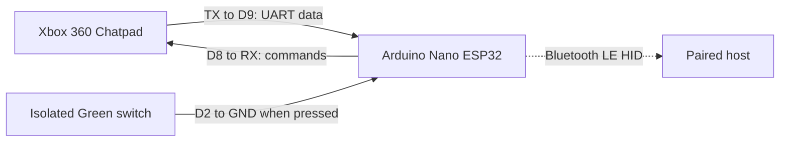

# Wiring

[← Project home](../README.md) · [Documentation](README.md) · [Getting started](GETTING_STARTED.md)

This firmware powers the chatpad conversion featured in the [full OG Steam Controller (2015) upgrade and modification video](https://www.youtube.com/watch?v=59sTsHHFOmE) on the **ZRZ YouTube channel**.

<p align="center">
  <a href="https://www.youtube.com/watch?v=59sTsHHFOmE">
    
  </a>
</p>

The default firmware uses a 19,200-baud UART link and a separate wake input from the isolated Green switch.

## Connection table

| Signal | Connect to | Purpose |
| :--- | :--- | :--- |
| Chatpad TX | Nano **D9 / GPIO18** | Nano receives Chatpad data. |
| Chatpad RX | Nano **D8 / GPIO17** | Nano sends initialisation, keep-alive, and LED commands. |
| Chatpad 3.3 V | **Regulated 3.3 V** | Verify rail voltage before connection. |
| Chatpad GND | **Common GND** | Shared with the Nano and supply. |
| Isolated Green switch, contact 1 | Nano **D2 / GPIO5** | Active-low input with internal pull-up. |
| Isolated Green switch, contact 2 | **GND** | Pressing the switch pulls D2 low. |
| Optional divider midpoint | Nano **A0 / GPIO1** | See the circuit below. |

TX and RX cross: each transmitter connects to the other device's receiver. UART configuration is **19,200 baud, 8 data bits, no parity, 1 stop bit**.



This is a signal-flow diagram, not a connector-orientation drawing. Identify the actual contacts on your Chatpad before soldering.

> [!IMPORTANT]
> Disconnect power before soldering or changing connections. The Chatpad power connection and signal interface in this design are **3.3 V**. Do not connect raw battery voltage or 5 V to those connections. Use the [official Nano ESP32 pinout](https://docs.arduino.cc/hardware/nano-esp32/) to identify board and power pins.

## Isolated Green switch

The firmware reads Green directly from **D2**, rather than using the Chatpad's reported Green modifier bit. This connection is required for both the modifier and waking from sleep.

Electrically isolate the switch from the original Chatpad matrix, then wire it between D2 and GND. With `INPUT_PULLUP` enabled, D2 reads **HIGH when released** and **LOW when pressed**.

Check switch connections and isolation with power disconnected. This repository does not yet contain a board-revision-specific trace-cut diagram; do not infer cut locations from the signal table.

Press **and release** Green when waking. Startup waits for the switch to be released before continuing.

## Pin numbering

The sketch uses the Nano's named constants: `D2`, `D8`, `D9`, and `A0`. Calls to lower-level ESP32 GPIO functions convert those names with `digitalPinToGPIONumber()`.

Arduino's [pin-numbering guide](https://support.arduino.cc/hc/en-us/articles/10483225565980-Select-pin-numbering-for-Nano-ESP32-in-Arduino-IDE) explains **By Arduino pin** and **By GPIO number** modes. Keep the named constants; a bare number such as `9` is not an interchangeable replacement for `D9` in every mode.

## Optional supply-voltage monitor

Fit this divider only if you want measured battery reporting:

```text
Regulated 3.3 V ─── 47 kΩ ───┬─── 47 kΩ ─── GND
                             │
                             ├─── A0
                             │
                           100 nF
                             │
                            GND
```

The equal resistors halve the monitored rail voltage; the firmware's default divider ratio is two. The capacitor connects between the midpoint and ground.

This monitors the **regulated rail**, not the raw cell. Leave battery reporting disabled if the divider is absent. See [calibration and limitations](CONFIGURATION.md#supply-monitoring) before enabling it.

## Before applying power

- Confirm supply voltage and common ground.
- Check that TX and RX are crossed as shown.
- Verify Green-switch isolation and its connection to D2.
- Check for solder bridges and shorts.
- If fitted, confirm A0 connects to the divider midpoint.

Continue with [software setup and first pairing](GETTING_STARTED.md).
